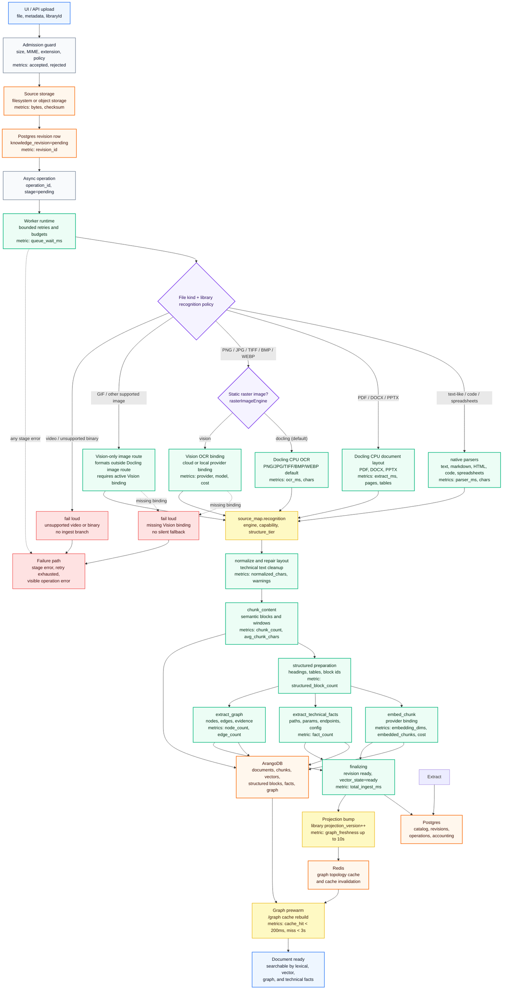

<p align="center">
  
</p>

<p align="center">
  
</p>

<h1 align="center">IronRAG</h1>
<p align="center">Production-grade knowledge memory for AI agents and teams</p>

<p align="center">
  <a href="https://github.com/mlimarenko/IronRAG/stargazers"></a>
  <a href="https://github.com/mlimarenko/IronRAG/releases"></a>
  <a href="https://hub.docker.com/r/pipingspace/ironrag-backend"></a>
  <a href="./LICENSE"></a>
</p>

<p align="center">
  <a href="./docs/en/README.md">English docs</a> &bull;
  <a href="./docs/ru/README.md">Документация</a> &bull;
  <a href="./docs/en/MCP.md">MCP</a> &bull;
  <a href="./docs/en/CLI.md">CLI</a> &bull;
  <a href="./docs/en/IAM.md">IAM</a>
</p>

---

IronRAG turns documents, code, PDFs, spreadsheets, and web pages into a structured knowledge base with a typed knowledge graph. AI agents query it over MCP; humans use the built-in UI. One self-hosted system -- your data stays on your infrastructure.

### Why IronRAG

- **Knowledge graph, not just vectors.** Entities, typed relationships, evidence chains, and document links -- agents reason over structure, not noisy similarity hits.
- **MCP server out of the box.** 21 tools for search, document reading, graph traversal, and web ingestion. Connect Claude, Cursor, VS Code, or any MCP client in one line.
- **Any provider.** OpenAI, DeepSeek, Qwen, or Ollama for fully local inference. Mix freely -- DeepSeek for reasoning, OpenAI for embeddings, Ollama for air-gapped environments.
- **Cost tracking.** Per-document extraction cost and per-query execution cost. Workspace-level price overrides.
- **Fine-grained IAM.** Scoped tokens at system, workspace, or library level. Permission groups control who reads, writes, or connects agents.
- **Code-aware.** 15-language AST parsing via tree-sitter. Config parsers for JSON, YAML, TOML. Technical fact extraction for endpoints, env vars, error codes.
- **CPU-first document recognition.** The backend image includes a Docling CPU runtime for PDF, document-layout Office files, and default raster-image OCR. Spreadsheets use the native tabular parser. No GPU is required; raster-image OCR can be switched per library to an active Vision binding.
- **Scales.** Tested on 5000+ documents, 25k+ graph nodes, 82k+ edges. Batched DB operations, streaming exports, memory-aware worker throttling.
- **Full backup/restore.** One-click tar.zst archive. Selective export (data only or with source files). Restore to the same or different deployment.

## Quick start

```bash
# One-line install (Docker required)
curl -fsSL https://raw.githubusercontent.com/mlimarenko/IronRAG/master/install.sh | bash
```

Or from source:

```bash
git clone https://github.com/mlimarenko/IronRAG.git
cd IronRAG/ironrag
cp .env.example .env          # add IRONRAG_OPENAI_API_KEY=sk-...
docker compose up -d
```

Open [http://127.0.0.1:19000](http://127.0.0.1:19000), create an admin account, upload a document, ask a question.

For fully local inference without cloud providers -- configure Ollama in Admin > AI.

### Other deployment options

```bash
# With S3-compatible storage (bundled s4core)
docker compose -f docker-compose-s4.yml up -d

# Local source build for development
docker compose -f docker-compose-local.yml up --build -d
```

Helm (Kubernetes):

```bash
helm upgrade --install ironrag charts/ironrag \
  --namespace ironrag --create-namespace \
  --set-string app.providerSecrets.openaiApiKey="${OPENAI_API_KEY}" \
  --wait --timeout 20m
```

## How it works

### Recognition routing

IronRAG has one extraction pipeline with an explicit recognition policy per
library. Docling is now embedded in the backend image as a CPU runtime, so the
default path works on ordinary servers and VMs without a GPU. Text-like and
spreadsheet files use deterministic native parsers; document-layout formats use
Docling; raster image OCR can stay local on Docling or use the active Vision
binding.

| Source family | Default engine | Configurable route |
|---------------|----------------|--------------------|
| Text, markup, code, CSV/TSV/XLS/XLSX/XLSB/ODS | `native` | no |
| PDF, DOCX, PPTX | `docling` | no |
| Static raster images (`png`, `jpg`, `tiff`, `bmp`, `webp`) | `docling` | `docling` or active `vision` binding |
| Other supported raster images | `vision` | requires active `vision` binding |

New libraries inherit
`IRONRAG_RECOGNITION_DEFAULT_RASTER_IMAGE_ENGINE=docling`. Operators can update
an individual library through
`PUT /v1/catalog/libraries/{libraryId}/recognition-policy` with
`{"rasterImageEngine":"docling"}` or `{"rasterImageEngine":"vision"}`. Invalid
engines and unknown policy fields are rejected; missing Vision bindings fail
loudly instead of falling back to another route. Video files are not part of the
current ingest surface.

### Document processing pipeline



### Grounded query pipeline

```mermaid
flowchart LR
  classDef entry fill:#eef6ff,stroke:#2563eb,stroke-width:2px,color:#0f172a
  classDef runtime fill:#f8fafc,stroke:#64748b,stroke-width:1.5px,color:#0f172a
  classDef retrieve fill:#ecfdf5,stroke:#059669,stroke-width:2px,color:#052e16
  classDef db fill:#fff7ed,stroke:#f97316,stroke-width:2px,color:#431407
  classDef answer fill:#f5f3ff,stroke:#7c3aed,stroke-width:2px,color:#2e1065
  classDef metric fill:#fef9c3,stroke:#ca8a04,stroke-width:1.5px,color:#422006
  classDef fail fill:#fee2e2,stroke:#dc2626,stroke-width:1.5px,color:#450a0a

  Ask["UI Assistant / MCP grounded answer<br/>question, libraryId, session"]:::entry
  Auth["Auth and library access<br/>metric: 401 / 403 / 200"]:::runtime
  Execution["Create query_execution<br/>runtimeExecutionId, query_id<br/>metric: trace completeness"]:::runtime
  Context["Conversation context<br/>follow-up rewrite, history focus<br/>metric: effective_query_text"]:::runtime
  IR["Query compiler IR<br/>act, scope, target types<br/>metrics: compile_ms, cache_hit"]:::runtime

  Postgres["Postgres<br/>sessions, executions,<br/>runtime stages, catalog"]:::db
  Redis["Redis<br/>IR cache, graph cache,<br/>answer-context cache"]:::db
  Arango["ArangoDB<br/>chunks, vectors, facts,<br/>graph nodes and edges"]:::db

  Vector["Vector lane<br/>ANN over chunk embeddings<br/>metrics: raw_hit_count > 0, vector_ms < 2s"]:::retrieve
  Lexical["Lexical and title lane<br/>BM25, title matches, topic families<br/>metrics: lexical_ms < 2s, distinct_docs"]:::retrieve
  Entity["Graph/entity lane<br/>person and entity evidence<br/>metric: evidence_chunk_count"]:::retrieve
  Literals["Technical literals lane<br/>paths, INI sections, params<br/>metric: literal_chunk_count"]:::retrieve

  Merge["Merge and diversify<br/>dedupe chunks and documents<br/>metric: retrieved_document_count"]:::retrieve
  Prune["Consolidate / topical prune<br/>single-doc focus or broad topic<br/>metrics: kept_chunks, removed_chunks"]:::retrieve
  Bundle["Context bundle assembly<br/>persist chunk refs and prepared refs<br/>metric: answer_context_chars"]:::retrieve

  Route["Answer router<br/>answer vs clarification<br/>metrics: disposition, variant_count"]:::answer
  Clarify["Clarification response<br/>lists variants, providers, documents<br/>metric: variant_count >= expected"]:::answer
  Generate["Grounded answer generation<br/>selected provider binding<br/>metrics: answer_ms, usage, model"]:::answer
  Verify["Verifier<br/>strict, moderate, lenient<br/>metric: verificationState"]:::answer
  Sources["Source links and evidence detail<br/>preparedSegmentReferences<br/>metrics: citations, document titles"]:::answer
  Response["Grounded response<br/>same quality target for UI and MCP<br/>metric: total_ms p95 <= 30s"]:::entry

  Fail["Fail loud<br/>missing binding 409/422,<br/>provider failure, no silent fallback"]:::fail

  Ask --> Auth --> Execution --> Context --> IR
  Execution --> Postgres
  IR <--> Redis
  IR --> Vector
  IR --> Lexical
  IR --> Entity
  IR --> Literals
  Vector <--> Arango
  Lexical <--> Arango
  Entity <--> Arango
  Literals <--> Arango
  Vector --> Merge
  Lexical --> Merge
  Entity --> Merge
  Literals --> Merge
  Merge --> Prune --> Bundle
  Bundle --> Postgres
  Bundle --> Arango
  Bundle --> Route
  Route -->|broad ambiguous topic| Clarify --> Sources --> Response
  Route -->|focused grounded query| Generate --> Verify --> Sources --> Response
  Generate -. provider or binding error .-> Fail
  Verify -. unsupported or conflicting answer .-> Fail
```



## Tech stack

| Layer | Technology |
|-------|-----------|
| Backend | Rust, Axum, tokio, SQLx |
| Frontend | React, Vite, TypeScript, Tailwind, shadcn/ui |
| Graph rendering | Sigma.js + Graphology (WebGL, Web Worker layout) |
| Knowledge graph | ArangoDB |
| Document store | PostgreSQL |
| Job queue | Redis |
| Code parsing | tree-sitter (15 languages) |
| Deployment | Docker Compose, Helm |

## MCP tools

21 tools out of the box. Create a token in **Admin > Access**, copy the snippet from **Admin > MCP**.

| Category | Tools |
|----------|-------|
| Documents | `search_documents`, `read_document`, `list_documents`, `upload_documents`, `update_document`, `delete_document` |
| Graph | `search_entities`, `get_graph_topology`, `list_relations` |
| Web crawl | `submit_web_ingest_run`, `get_web_ingest_run`, `cancel_web_ingest_run` |
| Q&A | `ask` (grounded answer in a single call) |
| Discovery | `list_workspaces`, `list_libraries` |

## Documentation

| | English | Russian |
|--|---------|---------|
| Overview | [README](./docs/en/README.md) | [README](./docs/ru/README.md) |
| Pipeline | [PIPELINE](./docs/en/PIPELINE.md) | [PIPELINE](./docs/ru/PIPELINE.md) |
| MCP | [MCP](./docs/en/MCP.md) | [MCP](./docs/ru/MCP.md) |
| IAM | [IAM](./docs/en/IAM.md) | [IAM](./docs/ru/IAM.md) |
| CLI | [CLI](./docs/en/CLI.md) | [CLI](./docs/ru/CLI.md) |

## Star History

<p align="center">
  <a href="https://star-history.com/#mlimarenko/IronRAG&Date">
    <picture>
      <source media="(prefers-color-scheme: dark)" srcset="https://api.star-history.com/svg?repos=mlimarenko/IronRAG&type=Date&theme=dark" />
      <source media="(prefers-color-scheme: light)" srcset="https://api.star-history.com/svg?repos=mlimarenko/IronRAG&type=Date" />
      
    </picture>
  </a>
</p>

## License

[MIT](./LICENSE)
