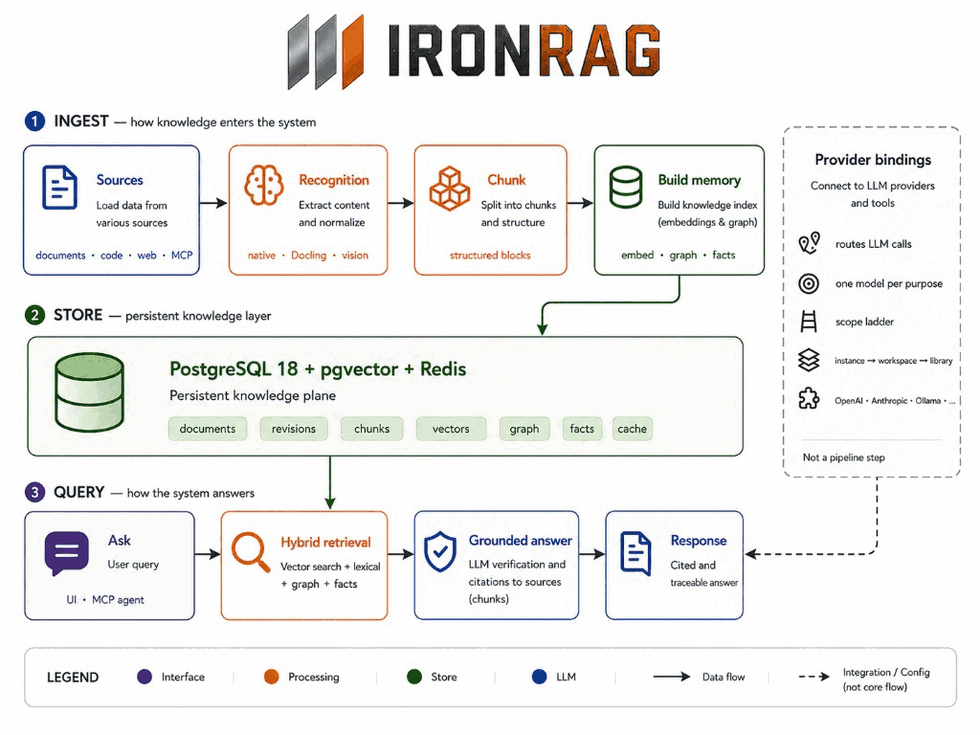

<p align="center">
  
</p>

<h1 align="center">IronRAG</h1>
<p align="center"><b>Self-hosted knowledge memory for AI agents and teams.</b><br/>One docker-compose, your data on your servers, any LLM provider.</p>

<p align="center">
  <a href="https://github.com/mlimarenko/IronRAG/stargazers"></a>
  <a href="https://github.com/mlimarenko/IronRAG/releases"></a>
  <a href="https://hub.docker.com/r/pipingspace/ironrag-backend"></a>
  <a href="./LICENSE"></a>
</p>

<p align="center">
  
</p>

## What IronRAG provides

- **Typed knowledge graph.** Documents are decomposed into entities, typed relationships, and chunk-level evidence references. Retrieval combines vector, lexical, graph-traversal, and technical-fact lanes; the answer pipeline returns citations to the underlying chunks.
- **Native MCP server.** 23 tools across documents, graph, web ingest, and grounded `ask`. Connect it to MCP-compatible agents and clients such as Claude Desktop, Claude Code, Cursor, Codex, VS Code with Continue / Cline / Roo, Zed, OpenClaw, Hermes, Lobe-style chat agents, or a custom HTTP MCP client. Tools are scoped per IAM token.
- **Provider-agnostic AI runtime.** Eight LLM providers ship in the catalog — OpenAI, DeepSeek, Qwen (DashScope-intl), GPTunnel, OpenRouter, RouterAI, MiniMax, Ollama. Each pipeline purpose (`extract_text`, `extract_graph`, `embed_chunk`, `query_compile`, `query_retrieve`, `query_answer`, `agent`, `vision`) is bound independently, with a vector rebuild utility for dimension-changing embedding switches.
- **USD cost catalog.** Every binding stores prices in USD. Per-call billing rows are written for every LLM request and rolled up per document and per query in the UI.
- **Multi-tenant IAM.** Principals, scoped tokens (system / workspace / library), and permission groups gate every API surface. Audit log captures resource access.
- **Self-hosted runtime.** The Docker Compose stack includes PostgreSQL with pgvector, Redis, backend, worker, and frontend services. Helm chart available for Kubernetes.
- **Code-aware ingest.** 15-language tree-sitter AST parsing. Native parsers for JSON / YAML / TOML / CSV / XLSX. Technical-fact extraction for paths, params, endpoints, env vars, and error codes.
- **CPU-first recognition.** Docling CPU runtime is baked into the backend image; PDF / DOCX / PPTX layout extraction, raster-image OCR, and embedded document-picture OCR run without a GPU. Stored PDFs are extracted through resumable page-range checkpoints, and image OCR can be switched per library to an active vision binding.
- **Restart-safe processing.** Long document jobs keep durable extraction units, reusable embedding / graph outputs, and lease-guarded finalization, so stack restarts or transient network breaks resume from the last completed unit instead of discarding hours of work.
- **Durable assistant turns.** UI answer streaming is an activity channel over the same persisted query execution; if the browser or proxy drops the stream after work starts, the frontend reloads the completed session result instead of submitting the question again. LLM debug snapshots are stored per execution for post-reload inspection.
- **Backup and restore.** Streaming `tar.zst` archive with selective sections (catalog only, with blobs, with graph). Restore to the same or a different deployment.
- **Pluggable source connectors.** Push content into IronRAG from a vendor system via a small Python adapter. Build your own on the [IronRAG Connector Template](https://github.com/mlimarenko/IronRAG.ConnectorTemplate), or run the [BookStack connector](https://github.com/mlimarenko/IronRAG.BookStack) and [Confluence connector](https://github.com/mlimarenko/IronRAG.Confluence) (pages + attachments + images, periodic poll + webhook intake).

<p align="center">
  
</p>

---

## Quick start

Install or update:

```bash
curl -fsSL https://raw.githubusercontent.com/mlimarenko/IronRAG/master/install.sh | bash
```

The installer is an interactive wizard: it inspects the host (CPU + RAM),
recommends a resource profile (per-service memory/CPU caps and ingest
parallelism), and prompts step by step for the port, optional admin bootstrap,
and provider API keys — each with a default you accept with Enter — then shows a
review screen before writing anything. On a re-run it preserves the existing
`.env` secrets and tuned caps, while official IronRAG image pins are advanced
to the selected release tag.

The installer also runs fully non-interactively. With no terminal (the piped
`curl | bash` form), or with `--yes` / `--non-interactive`, it takes every answer
from flags, environment variables, and existing `.env` values. Answer precedence
is flags > env > prompt for non-secret values; secrets (admin password, provider
API keys) are accepted via environment variables or a pre-seeded `.env` only —
never as flags, since argv is visible to other processes and shell history. Run
`./install.sh --help` for the full flag and environment-variable list, or
`--plan-only` to print the detected profile without writing or deploying anything.

Non-interactive example (CI / Ansible):

```bash
curl -fsSL https://raw.githubusercontent.com/mlimarenko/IronRAG/master/install.sh -o install.sh
IRONRAG_PORT=8080 \
IRONRAG_PROFILE=small \
IRONRAG_OPENAI_API_KEY=sk-... \
  bash install.sh --non-interactive
```

Or from source:

```bash
git clone https://github.com/mlimarenko/IronRAG.git
cd IronRAG
cp .env.example .env             # add IRONRAG_OPENAI_API_KEY=sk-...
docker compose up -d
```

Open [http://127.0.0.1:19000](http://127.0.0.1:19000), create an admin account, upload a document, and ask a question.

> **Telemetry.** By default the stack sends anonymous performance telemetry —
> OpenTelemetry traces and metrics — to the project maintainers' collector to
> help improve IronRAG. These signals carry request timings, stage durations,
> counters and identifiers (library/document/chunk UUIDs), not your documents,
> queries, answers or credentials; logs are the only content-bearing signal and
> are off by default. Each deployment is labelled with a stable, auto-generated
> `ironrag.deployment.id`. To opt out entirely set `IRONRAG_OTEL_ENABLED=false`,
> or point telemetry at your own collector with `OTEL_EXPORTER_OTLP_ENDPOINT`
> (see [`apps/api/observability.toml`](apps/api/observability.toml)).

## Multi-provider configuration

Set as many provider keys as you need in `.env` — credentials auto-register on the next restart, and every model preset becomes available in the admin UI.

```env
IRONRAG_OPENAI_API_KEY=sk-...
IRONRAG_DEEPSEEK_API_KEY=...
IRONRAG_QWEN_API_KEY=sk-...
IRONRAG_GPTUNNEL_API_KEY=...
IRONRAG_OPENROUTER_API_KEY=<openrouter-api-key>
IRONRAG_ROUTERAI_API_KEY=...
IRONRAG_MINIMAX_API_KEY=...
```


| Provider                  | Chat | Vision | Embedding | Notes                                                                |
| ------------------------- | ---- | ------ | --------- | -------------------------------------------------------------------- |
| **OpenAI**                | ✅    | ✅      | ✅         | Direct API                                                           |
| **DeepSeek**              | ✅    | —      | —         | Very low cost; may be slower than other APIs; no native vision/embeddings |
| **Qwen / DashScope-intl** | ✅    | ✅      | ✅         | Cost is close to DeepSeek; API is often faster; strong chat/vision/embedding lane |
| **GPTunnel**              | ✅    | ✅      | ✅         | Router provider: many upstream model families behind one key         |
| **OpenRouter**            | ✅    | ✅      | ✅         | Router provider: many upstream model families behind one key         |
| **RouterAI**              | ✅    | ✅      | ✅         | Router provider: many upstream model families behind one key         |
| **MiniMax**               | ✅    | ✅      | —         | Direct API or Token Plan subscription key                            |
| **Ollama**                | ✅    | ✅      | ✅         | Fully local, air-gapped, GPU optional                                |
| **LiteLLM**               | ✅    | ✅      | ✅         | Self-hosted OpenAI-compatible gateway: add as an OpenAI-compatible account with your LiteLLM base URL; proxies any upstream model family |


Bind any provider to any pipeline purpose under **Admin → AI → Bindings**: `extract_text`, `extract_graph`, `embed_chunk`, `query_compile`, `query_retrieve`, `query_answer`, `agent`, `vision`. The bindings are scoped to instance, workspace, or library — a workspace can override the instance default for a single purpose.

Recognition note: the default raster-image engine is `vision`, so image OCR runs through the active `vision` binding (seeded by default in the bundled stack). Switch a library to the `docling` engine to OCR images with the local Docling runtime and make no vision LLM calls. The `vision` and `extract_text` bindings are otherwise optional, but selecting the `vision` engine without a configured `vision` binding fails loudly.

## Common deployments

- **Internal knowledge bot.** A company library is fed from BookStack, Confluence, Google Drive, SharePoint, or a recursive web crawl. Engineering, support, and policy questions are answered through the UI assistant or via MCP, with citations linking back to the original chunks.
- **Public portal / helpdesk assistant.** A self-hosted assistant fronts your published documentation, release notes, and runbooks. The MCP `ask` tool drives a chat widget; queries do not leave the host infrastructure.
- **Engineering / coding agent.** AST-parsed source trees and extracted technical facts (endpoints, env vars, config keys, error codes) give an MCP-connected agent structured context for architecture and "what changed" questions across releases.
- **Personal long-term memory.** A single-tenant deployment used as a long-lived second brain — papers, notes, code snippets, web clippings — queried from any MCP client. The graph grows as the library grows.
- **On-prem / regulated AI.** Bind every purpose to Ollama for an air-gapped runtime. The deployment is inert outside its own network: no provider telemetry, IAM-scoped tokens, full backup archive for retention.

---

## Tech stack


| Layer                    | Technology                                                      |
| ------------------------ | --------------------------------------------------------------- |
| Backend                  | Rust 1.96, axum 0.8, tokio 1.52, SQLx 0.8, tower 0.5          |
| Frontend                 | React 19.2, Vite 8.0, TypeScript 6.0, Tailwind 4.3, shadcn/ui |
| Frontend build/runtime   | Node 26 (build), Nginx 1.30 (static serving)                    |
| Graph rendering          | Sigma.js 3 + Graphology 0.26 (WebGL, Web Worker layout)       |
| Database                 | PostgreSQL 18 (pgvector image)                                  |
| Knowledge-plane search   | pgvector, PostgreSQL full-text search, `pg_trgm`                |
| Cache / job queue        | Redis 8.8                                                       |
| Document recognition     | Docling CPU runtime, native parsers, tree-sitter (15 languages) |
| MCP                      | Streamable HTTP MCP server (2025-06-18), 23 tools               |
| Deployment               | Docker Compose, Helm chart                                      |

## Pipeline overview

<p align="center">
  
</p>

1. **Ingest.** Files, web pages, and API / MCP uploads enter the recognition router (`extract_text`), stored PDFs are checkpointed by page range, source text is split into structured chunks (`chunk_content` + structured-block preparation), and persisted to PostgreSQL.
2. **Build memory.** Each chunk is embedded (`embed_chunk`), scanned for technical literals (`extract_technical_facts`), and processed by `extract_graph` to write entities, typed relations, and evidence references.
3. **Query.** A query session compiles the user request into typed IR (`query_compile`); vector, lexical, graph-traversal, and technical-fact lanes retrieve concurrently; the answer router selects between a grounded answer (`query_answer`) and a clarification, runs the verifier, and persists citations to the response.
4. **Provider routing.** Every LLM call resolves through the binding for its purpose. Switching `query_answer` from OpenAI to a local Ollama model is a binding change at the matching scope (instance / workspace / library).

For deep dives:


| Topic                        | English                                          | Russian                                          |
| ---------------------------- | ------------------------------------------------ | ------------------------------------------------ |
| Architecture overview        | [docs/en/README.md](./docs/en/README.md)         | [docs/ru/README.md](./docs/ru/README.md)         |
| Ingestion pipeline           | [docs/en/PIPELINE.md](./docs/en/PIPELINE.md)     | [docs/ru/PIPELINE.md](./docs/ru/PIPELINE.md)     |
| MCP server & tools           | [docs/en/MCP.md](./docs/en/MCP.md)               | [docs/ru/MCP.md](./docs/ru/MCP.md)               |
| IAM & tokens                 | [docs/en/IAM.md](./docs/en/IAM.md)               | [docs/ru/IAM.md](./docs/ru/IAM.md)               |
| CLI reference                | [docs/en/CLI.md](./docs/en/CLI.md)               | [docs/ru/CLI.md](./docs/ru/CLI.md)               |
| Frontend architecture        | [docs/en/FRONTEND.md](./docs/en/FRONTEND.md)     | [docs/ru/FRONTEND.md](./docs/ru/FRONTEND.md)     |
| Frontend transport (TLS/QUIC)| [docs/en/FRONTEND-TRANSPORT.md](./docs/en/FRONTEND-TRANSPORT.md) | [docs/ru/FRONTEND-TRANSPORT.md](./docs/ru/FRONTEND-TRANSPORT.md) |
| Capacity planning            | [docs/en/CAPACITY-PLANNING.md](./docs/en/CAPACITY-PLANNING.md) | [docs/ru/CAPACITY-PLANNING.md](./docs/ru/CAPACITY-PLANNING.md) |
| Webhooks                     | [docs/en/WEBHOOK.md](./docs/en/WEBHOOK.md)       | [docs/ru/WEBHOOK.md](./docs/ru/WEBHOOK.md)       |
| Benchmarks                   | [docs/en/BENCHMARKS.md](./docs/en/BENCHMARKS.md) | [docs/ru/BENCHMARKS.md](./docs/ru/BENCHMARKS.md) |
| Changelog                    | [CHANGELOG.md](./CHANGELOG.md)                   | —                                                |


## Other deployment options

All variants live in the single `docker-compose.yml`, selected by env and one
profile (see the file header for the full list):

```bash
# With S3-compatible storage (bundled s4core), via the `s4` profile
COMPOSE_PROFILES=s4 \
  IRONRAG_CONTENT_STORAGE_PROVIDER=s3 \
  IRONRAG_DEPENDENCY_OBJECT_STORAGE_MODE=bundled \
  IRONRAG_CONTENT_STORAGE_TOPOLOGY=shared_cluster \
  docker compose up -d

# Local source build for development
IRONRAG_BACKEND_IMAGE=ironrag-backend:local \
  IRONRAG_FRONTEND_IMAGE=ironrag-frontend:local \
  docker compose up -d --build

# Larger host (24-32 GiB): raise the per-role memory caps
IRONRAG_DB_MEMORY_LIMIT=6144M \
  IRONRAG_BACKEND_MEMORY_LIMIT=4096M \
  IRONRAG_WORKER_MEMORY_LIMIT=4096M \
  docker compose up -d
```

The default Compose stack keeps ingest conservative on small swapless hosts:
`IRONRAG_INGESTION_MAX_PARALLEL_JOBS_GLOBAL=4`,
`IRONRAG_INGESTION_MAX_PARALLEL_JOBS_PER_WORKSPACE=2`, and
`IRONRAG_INGESTION_MAX_PARALLEL_JOBS_PER_LIBRARY=1`. Raise those only together
with worker memory, database connection budget, and provider concurrency.

Helm (Kubernetes):

```bash
helm upgrade --install ironrag charts/ironrag \
  --namespace ironrag --create-namespace \
  --set-string app.providerSecrets.openaiApiKey="${OPENAI_API_KEY}" \
  --wait --timeout 20m
```

By default the chart deploys the API, worker, and web images with the
`v<appVersion>` image tag derived from `Chart.appVersion`. Override
`api.image.tag`, `worker.image.tag`, and `web.image.tag` only when pinning
a different published image, for example `--set web.image.tag=v0.5.5`.

Bundled dependencies (same pins as Docker Compose): `pgvector/pgvector:pg18`
for PostgreSQL and `redis:8.8` for Redis. Override via
`dependencies.postgres.image.*` and `dependencies.redis.image.*` when needed.

## Star history

<p align="center">
  <a href="https://star-history.com/#mlimarenko/IronRAG&Date">
    <picture>
      <source media="(prefers-color-scheme: dark)" srcset="https://api.star-history.com/svg?repos=mlimarenko/IronRAG&type=Date&theme=dark" />
      <source media="(prefers-color-scheme: light)" srcset="https://api.star-history.com/svg?repos=mlimarenko/IronRAG&type=Date" />
      
    </picture>
  </a>
</p>

## License

[MIT](./LICENSE)
