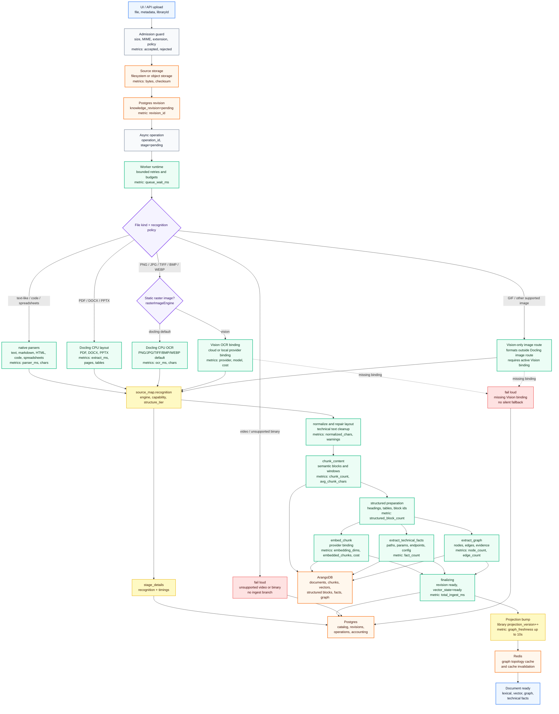

<p align="center">
  
</p>

<h1 align="center">IronRAG</h1>

<p align="center">
  Production-grade knowledge memory for AI agents and teams.<br/>
  Upload documents. Build a knowledge graph. Ask questions. Ship agents.
</p>

<p align="center">
  
</p>

---

## What is IronRAG?

IronRAG turns your documents, code, PDFs, spreadsheets, and web pages into a structured knowledge base that AI agents and humans can query instantly. It is a self-hosted, open-source system that runs on your infrastructure and keeps your data under your control.

Unlike simple vector databases, IronRAG builds a **knowledge graph** from your content: entities, relationships, evidence chains, and document links. Agents that connect to IronRAG don't just search text -- they reason over structured knowledge.

## Why IronRAG?

**For AI engineers building production agents:**

- **MCP server out of the box.** Connect Claude, Cursor, VS Code, or any MCP-compatible agent in one line. 21 tools covering search, document reading, graph traversal, and web ingestion -- all permission-gated per token.
- **Structured memory, not just embeddings.** The knowledge graph captures entities, typed relationships, and evidence with support ranking. Agents get grounded context, not noisy similarity hits.
- **Multi-provider flexibility.** Use OpenAI, DeepSeek, Qwen, or **Ollama for fully local inference** -- no cloud dependency required. Mix providers freely: DeepSeek for reasoning, OpenAI for embeddings, Ollama for privacy-sensitive workloads.
- **CPU-first document recognition.** The backend image includes a Docling CPU runtime for PDF, document-layout Office files, and default raster-image OCR. Spreadsheets use the native tabular parser. No GPU is required; raster-image OCR can be switched per library to an active Vision binding.
- **Cost tracking per query and document.** Every LLM call is metered. See per-document extraction cost and per-query execution cost in the dashboard. Set workspace-level price overrides.

**For teams managing knowledge:**

- **Upload anything.** PDF, DOCX, PPTX, XLSX, CSV, Markdown, HTML, source code (15 languages with AST parsing), images (via vision models), and web pages (single-page or recursive crawl).
- **Knowledge graph visualization.** Interactive WebGL graph with 60fps rendering at 25k+ nodes. Entity types, sub-types, relationship exploration, drag, zoom, filter by type.
- **Grounded answers with sources.** Every answer cites specific document sections. Verification guardrails reject unsupported claims.
- **Full backup and restore.** One-click tar.zst archive export with selective inclusion. Restore to the same or different deployment. Designed for GitLab-style backup workflows.

**For ops teams running production:**

- **Fine-grained IAM.** Scoped tokens at system, workspace, or library level. Permission groups control who can read, write, admin, or connect agents.
- **Scales with your data.** Tested on libraries with 5000+ documents, 25k+ graph nodes, 82k+ edges. Batched database operations, streaming exports, connection pool tuning, and memory-aware worker throttling.
- **Observable.** Prometheus metrics, structured tracing, audit log with surface/result filters, per-document pipeline stage timings.
- **Single Docker Compose.** Postgres, ArangoDB, Redis, backend, worker, frontend -- all in one `docker compose up -d`. Helm chart available for Kubernetes.

## How it works

### What changed with Docling

The ingestion pipeline is still single-path, but `extract_content` now routes
recognition explicitly by file kind and library recognition policy:

- text/code/spreadsheets use deterministic `native` parsers;
- PDF, DOCX, and PPTX use the embedded Docling CPU runtime;
- static raster images use Docling OCR by default;
- raster-image OCR can be switched to the active `vision` binding per library;
- a missing Vision binding fails loudly instead of falling back silently;
- video files are not part of the current ingest surface.

New libraries inherit
`IRONRAG_RECOGNITION_DEFAULT_RASTER_IMAGE_ENGINE=docling`. A single library can
be changed through `PUT /v1/catalog/libraries/{libraryId}/recognition-policy`
with `{"rasterImageEngine":"docling"}` or `{"rasterImageEngine":"vision"}`.

### Document Processing Pipeline



### Grounded Query Pipeline

```mermaid
flowchart LR
  classDef entry fill:#eef6ff,stroke:#2563eb,stroke-width:2px,color:#0f172a
  classDef runtime fill:#f8fafc,stroke:#64748b,stroke-width:1.5px,color:#0f172a
  classDef retrieve fill:#ecfdf5,stroke:#059669,stroke-width:2px,color:#052e16
  classDef db fill:#fff7ed,stroke:#f97316,stroke-width:2px,color:#431407
  classDef answer fill:#f5f3ff,stroke:#7c3aed,stroke-width:2px,color:#2e1065
  classDef fail fill:#fee2e2,stroke:#dc2626,stroke-width:1.5px,color:#450a0a

  Ask["UI Assistant / MCP grounded_answer<br/>question, libraryId, session"]:::entry
  Auth["Auth and library access"]:::runtime
  Execution["query_execution<br/>runtimeExecutionId, query_id"]:::runtime
  Rewrite["Conversation context<br/>follow-up rewrite, focus"]:::runtime
  IR["Query compiler IR<br/>intent, scope, target types"]:::runtime

  Arango["ArangoDB<br/>chunks, vectors, facts,<br/>graph nodes and edges"]:::db
  Postgres["Postgres<br/>sessions, executions,<br/>catalog, traces"]:::db
  Redis["Redis<br/>IR cache, graph cache,<br/>answer-context cache"]:::db

  Vector["Vector lane<br/>chunk embeddings"]:::retrieve
  Lexical["Lexical lane<br/>BM25, titles, literals"]:::retrieve
  Entity["Graph/entity lane<br/>entities and evidence paths"]:::retrieve
  Facts["Technical facts lane<br/>paths, params, config keys"]:::retrieve
  Merge["Merge, dedupe, diversify<br/>chunks + documents + graph evidence"]:::retrieve
  Bundle["Context bundle<br/>citations, prepared refs, graph facts"]:::retrieve

  Route{"Answer router"}:::answer
  Clarify["Clarification<br/>topic too broad or variants found"]:::answer
  Generate["Grounded answer generation<br/>selected QueryAnswer binding"]:::answer
  Verify["Verifier<br/>strict / moderate / lenient"]:::answer
  Response["Grounded response<br/>answer + citations + verifier"]:::entry
  Fail["fail loud<br/>missing binding or provider failure"]:::fail

  Ask --> Auth --> Execution --> Rewrite --> IR
  Execution --> Postgres
  IR <--> Redis
  IR --> Vector
  IR --> Lexical
  IR --> Entity
  IR --> Facts
  Vector <--> Arango
  Lexical <--> Arango
  Entity <--> Arango
  Facts <--> Arango
  Vector --> Merge
  Lexical --> Merge
  Entity --> Merge
  Facts --> Merge
  Merge --> Bundle
  Bundle --> Postgres
  Bundle --> Route
  Route -->|"broad / ambiguous"| Clarify --> Response
  Route -->|"focused grounded query"| Generate --> Verify --> Response
  Generate -. provider error .-> Fail
  Verify -. unsupported answer .-> Fail
```



1. **Upload** a document (API, UI, MCP, or web crawl).
2. **Recognize** content through `native`, Docling CPU, or a `vision` binding based on explicit policy.
3. **Normalize** into structured blocks: headings, paragraphs, tables, code, images.
4. **Extract** entities and relationships via LLM -- builds the knowledge graph.
5. **Embed** chunks for vector similarity search.
6. **Query** combines vector, lexical, graph/entity, and technical-facts lanes.
7. **Answer** is generated from assembled context and verified against source evidence.

## Tech stack

| Layer | Technology |
|-------|-----------|
| Backend | Rust, Axum, tokio |
| Frontend | React, Vite, TypeScript, Tailwind, shadcn/ui |
| Graph rendering | Sigma.js, Graphology (WebGL, Web Worker layout) |
| Document store | PostgreSQL |
| Knowledge graph | ArangoDB |
| Job coordination | Redis |
| Code parsing | tree-sitter (15 languages) |
| Backup format | tar.zst (streaming, chunked NDJSON) |

## Quick start

```bash
git clone https://github.com/mlimarenko/IronRAG.git
cd IronRAG/ironrag
cp .env.example .env
# Add your API key: IRONRAG_OPENAI_API_KEY=sk-...
docker compose up -d
```

Open [http://127.0.0.1:19000](http://127.0.0.1:19000), create an admin account, upload a document, and ask a question.

For local-only inference without any cloud provider, configure Ollama bindings in the Admin panel.

## Documentation

| Topic | Link |
|-------|------|
| Ingestion pipeline | [PIPELINE.md](./PIPELINE.md) |
| MCP integration | [MCP.md](./MCP.md) |
| IAM & tokens | [IAM.md](./IAM.md) |
| CLI reference | [CLI.md](./CLI.md) |
| Frontend architecture | [FRONTEND.md](./FRONTEND.md) |
| Benchmarks | [BENCHMARKS.md](./BENCHMARKS.md) |

## Helm install

```bash
helm upgrade --install ironrag charts/ironrag \
  --namespace ironrag --create-namespace \
  --set-string app.providerSecrets.openaiApiKey="${OPENAI_API_KEY}" \
  --wait --timeout 20m
```

## License

[MIT](../../LICENSE)
