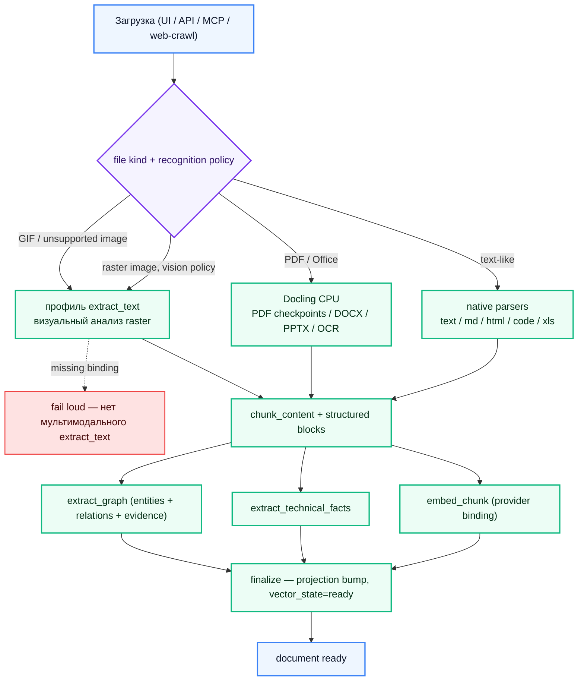
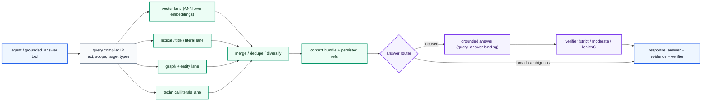

# IronRAG — техническая документация (RU)

Технический справочник для операторов, интеграторов и контрибьюторов
IronRAG. Продуктовый обзор и quick start — в [главном
README](../../README.md); этот каталог — точка входа в более глубокий
технический материал.

## Индекс документов

| Файл | Тема |
|---|---|
| [PIPELINE.md](./PIPELINE.md) | Пайплайн ингеста: маршрутизация распознавания, чанкинг, structured-prep, embedding, технические факты и графовая экстракция, finalize. |
| [MCP.md](./MCP.md) | MCP-сервер, 23 инструмента, scope-токены, режимы транспорта. |
| [IAM.md](./IAM.md) | Модель идентификации/доступа: principals, scope, permission groups, токены system / workspace / library. |
| [CLI.md](./CLI.md) | Справочник `ironrag-cli`: бэкфилы, GC, сброс пароля, миграционные хелперы. |
| [FRONTEND.md](./FRONTEND.md) | Архитектура React 19 + Vite приложения: вертикальные feature-folders, генерируемый SDK, server-state контракт. |
| [FRONTEND-TRANSPORT.md](./FRONTEND-TRANSPORT.md) | Nginx frontend: HTTP по умолчанию, опциональный TLS/HTTP2/HTTP3, чеклист reverse proxy. |
| [CAPACITY-PLANNING.md](./CAPACITY-PLANNING.md) | Профили хоста, диск и vector sizing, memory-лимиты для крупных хостов. |
| [WEBHOOK.md](./WEBHOOK.md) | Outbound webhook subsystem: события, контракт payload, подпись, retry-политика. |
| [AI-BINDINGS.md](./AI-BINDINGS.md) | Шесть канонических AI-профилей, scope-лестница, wire-level prompt layout, tradeoff'ы выбора модели и грабли prompt cache. |
| [BENCHMARKS.md](./BENCHMARKS.md) | Grounded-query benchmark suites, retrieval rank metrics, ingest smoke checks и workflow сравнения. |
| [Upgrade from 0.4.x](../../README.md#upgrading-from-04x) | Короткий путь обновления 0.4.x → 0.5.0; полная процедура описана в changelog. |

## Пайплайн в одном кадре

Recognition policy задаётся per-library
(`PUT /v1/catalog/libraries/{libraryId}/recognition-policy` с
`{"rasterImageEngine":"docling"}` или `{"rasterImageEngine":"vision"}`).
Новые библиотеки наследуют
`IRONRAG_RECOGNITION_DEFAULT_RASTER_IMAGE_ENGINE=docling`. Отсутствие
мультимодального профиля «Понимание документов» (`extract_text`) падает явно,
когда policy выбирает `vision`; silent provider substitution запрещён.

Stored PDFs restart-safe: завершённые Docling page ranges сохраняются как
ingest units и переиспользуются после worker restart, backend restart, lease
recovery или краткого сетевого обрыва. Chunk embeddings и graph-extraction
outputs также переиспользуются по устойчивым checksums при resume job.

Assistant turns тоже durable: UI streaming передаёт activity для того же
persisted query execution, а browser/proxy transport drop после старта работы
восстанавливается чтением завершённого session result без повторной отправки
prompt. LLM debug snapshots сохраняются per execution, поэтому provider context
остаётся доступен после reload и cached replay.

## Grounded-запрос в одном кадре

Индекс и query embedding используют один профиль `embed_chunk`. При смене
embedding space нужно запустить vector rebuild для затронутой source-библиотеки,
даже если размерность осталась прежней. PostgreSQL хранит
vector material в per-`(library, dim)` pgvector relations, учтённых в manifest,
поэтому rebuild пересчитывает затронутый vector material до использования
нового retrieval lane.

Lexical retrieval тоже структурируется скомпилированным `QueryIR`: high/low lane
seeds берутся из typed subjects, target types, document focus, literals и
refinements. Если IR для turn недостаточно надёжен, lexical retrieval
возвращается к полному набору extracted keywords.

## Карта хранилищ

| Хранилище | Роль |
|---|---|
| **PostgreSQL** | Catalog (workspaces, libraries, documents, revisions), durable ingest units, AI catalog (providers, models, prices, accounts и inline binding profiles), IAM, sessions, query executions, billing, knowledge documents, chunks, technical facts, graph data, context bundles, pgvector embeddings и PostgreSQL full-text search indexes. |
| **Redis** (redis:8.8) | Graph topology cache, IR cache, answer-context cache, координация prewarm. |
| **Filesystem / S3** | Source-document блобы (конфигурируется; включённый `s4core` даёт встроенный S3-совместимый blob-store). |

## Multi-provider router

Каждый binding выбирает `ai_account` и строку `ai_model_catalog`, а
prompt и sampling settings хранятся прямо в `ai_binding`. Ровно пять
профилей обязательны: `extract_graph`, `embed_chunk`, `query_compile`,
`query_answer` и `agent`. Мультимодальный `extract_text` опционален. Каталог
содержит восемь профилей провайдеров — OpenAI, DeepSeek, Qwen /
DashScope-intl, GPTunnel, OpenRouter, RouterAI, MiniMax и Ollama. Каждый описан в
`ai_provider_catalog` через capability-флаги, runtime-paths, конфигурацию
model-discovery и bootstrap model entries.

Запись binding'ов поддерживает следующие runtime-инварианты:

- Модель должна объявлять purpose в `defaultRoles`
  (`ai_catalog_service::catalog::validate_model_binding_purpose`).
- `embed_chunk` — единственный профиль для stored и query vectors; второй
  binding не может выбрать несовместимый embedding space.
- Любая смена embedding space финализируется запуском vector rebuild, чтобы
  pgvector relations и сохранённые векторы менялись вместе даже при одинаковой
  размерности.

Scopes резолвятся library → workspace → instance, поэтому workspace
может переопределить instance-default для одной purpose без влияния
на остальные.

### MCP-клиенты

MCP-сервер транспорт-агностичен. Документированные интеграции:
Claude Desktop, Claude Code, Cursor, Codex, VS Code (Continue / Cline /
Roo), Zed, OpenClaw, Hermes, Lobe-style chat-агенты, локальный
`grounded_answer` через IronRAG CLI. Scope токена ограничивает набор
инструментов; см. [IAM.md](./IAM.md).

См. [../../README.md](../../README.md) для оператор-ориентированного
резюме и [PIPELINE.md](./PIPELINE.md) — для контракта purpose'ов.

## License

[MIT](../../LICENSE)
