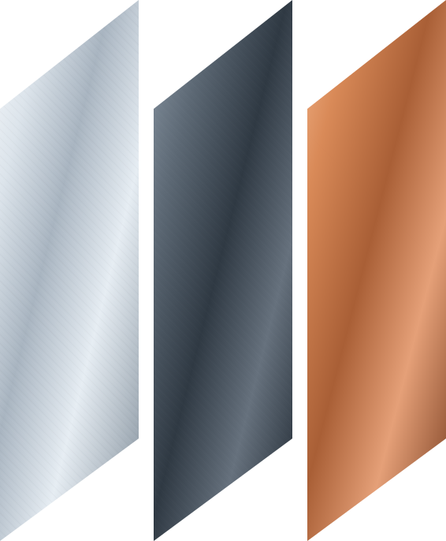
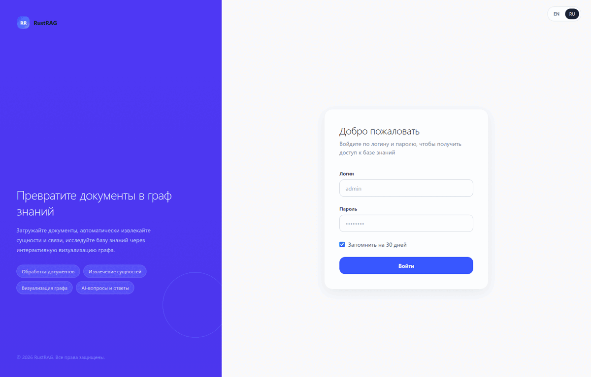

<p align="center">
  
</p>

<h1 align="center">IronRAG</h1>

<p align="center">
  Продакшн-память для AI-агентов и команд.<br/>
  Загрузите документы. Постройте граф знаний. Задайте вопрос. Запускайте агентов.
</p>

<p align="center">
  
</p>

---

## Что такое IronRAG?

IronRAG превращает ваши документы, код, PDF, таблицы и веб-страницы в структурированную базу знаний, к которой AI-агенты и люди обращаются мгновенно. Это self-hosted open-source система, которая работает на вашей инфраструктуре и ваши данные остаются под вашим контролем.

В отличие от простых векторных баз, IronRAG строит **граф знаний** из вашего контента: сущности, связи, цепочки подтверждений и ссылки на документы. Агенты, подключенные к IronRAG, не просто ищут текст -- они рассуждают над структурированным знанием.

## Почему IronRAG?

**Для AI-инженеров, строящих продакшн-агентов:**

- **MCP-сервер из коробки.** Подключите Claude, Cursor, VS Code или любого MCP-совместимого агента одной строкой. 21 инструмент: поиск, чтение документов, обход графа, web-ingestion -- всё с разграничением прав по токену.
- **Структурированная память, а не просто эмбеддинги.** Граф знаний фиксирует сущности, типизированные связи и evidence с ранжированием по поддержке. Агенты получают обоснованный контекст, а не шумные similarity-хиты.
- **Мульти-провайдер.** OpenAI, DeepSeek, Qwen или **Ollama для полностью локального вывода** -- без зависимости от облака. Комбинируйте свободно: DeepSeek для рассуждений, OpenAI для эмбеддингов, Ollama для чувствительных данных.
- **Учёт стоимости по каждому запросу и документу.** Каждый вызов LLM тарифицируется. Видите стоимость обработки документа и выполнения запроса в дашборде. Можно задать свои тарифы по workspace.

**Для команд, управляющих знаниями:**

- **Загружайте что угодно.** PDF, DOCX, PPTX, XLSX, CSV, Markdown, HTML, код (15 языков с AST-парсингом через tree-sitter), изображения (через vision-модели), веб-страницы (одиночные или рекурсивный обход).
- **Визуализация графа знаний.** Интерактивный WebGL-граф с рендерингом 60fps на 25k+ узлах. Типы сущностей, подтипы, исследование связей, drag, zoom, фильтрация по типам.
- **Обоснованные ответы с источниками.** Каждый ответ ссылается на конкретные разделы документов. Guardrails верификации отклоняют необоснованные утверждения.
- **Полный бэкап и восстановление.** Экспорт в tar.zst архив одним кликом с выбором что включать. Восстановление на том же или другом развёртывании. Спроектирован для GitLab-style бэкап-сценариев.

**Для ops-команд в продакшне:**

- **Гранулярный IAM.** Scoped-токены на уровне системы, workspace или библиотеки. Группы прав контролируют кто может читать, писать, администрировать или подключать агентов.
- **Масштабируется с данными.** Протестировано на библиотеках с 5000+ документами, 25k+ узлами графа, 82k+ связями. Batch-операции, стриминговый экспорт, тюнинг пулов соединений, memory-aware ограничение воркеров.
- **Наблюдаемость.** Prometheus-метрики, structured tracing, аудит-лог с фильтрами по surface/result, тайминги стадий обработки каждого документа.
- **Один Docker Compose.** Postgres, ArangoDB, Redis, backend, worker, frontend -- всё в одном `docker compose up -d`. Helm chart для Kubernetes.

## Как это работает

```
Документы ──> Парсинг ──> Чанкинг ──> Эмбеддинг ──> Векторный индекс
                 │                        │
                 └──> Извлечение графа ──> Граф знаний
                         (LLM)              (ArangoDB)
                                               │
Запрос ──> Гибридный поиск ──> Обход графа ──> Сборка контекста ──> Ответ LLM
            (BM25 + Vector)                        │
                                           Верификация ──> Обоснованный ответ
```

1. **Загрузка** документа (API, UI, MCP или web crawl).
2. **Парсинг** в структурированные блоки (заголовки, абзацы, таблицы, код, изображения).
3. **Извлечение** сущностей и связей через LLM -- строится граф знаний.
4. **Эмбеддинг** чанков для векторного поиска.
5. **Запрос** комбинирует векторный поиск, BM25 лексический поиск и обход графа.
6. **Ответ** генерируется из собранного контекста и верифицируется по source evidence.

## Технологический стек

| Слой | Технология |
|------|-----------|
| Backend | Rust, Axum, tokio |
| Frontend | React, Vite, TypeScript, Tailwind, shadcn/ui |
| Рендеринг графа | Sigma.js, Graphology (WebGL, Web Worker layout) |
| Хранение документов | PostgreSQL |
| Граф знаний | ArangoDB |
| Координация задач | Redis |
| Парсинг кода | tree-sitter (15 языков) |
| Формат бэкапов | tar.zst (стриминг, чанкованный NDJSON) |

## Быстрый старт

```bash
git clone https://github.com/mlimarenko/IronRAG.git
cd IronRAG/ironrag
cp .env.example .env
# Добавьте ключ: IRONRAG_OPENAI_API_KEY=sk-...
docker compose up -d
```

Откройте [http://127.0.0.1:19000](http://127.0.0.1:19000), создайте admin-аккаунт, загрузите документ и задайте вопрос.

Для полностью локальной работы без облачного провайдера настройте Ollama bindings в Admin-панели.

## Документация

| Тема | Ссылка |
|------|--------|
| Пайплайн обработки | [PIPELINE.md](./PIPELINE.md) |
| MCP-интеграция | [MCP.md](./MCP.md) |
| IAM и токены | [IAM.md](./IAM.md) |
| CLI-справочник | [CLI.md](./CLI.md) |
| Архитектура фронтенда | [FRONTEND.md](./FRONTEND.md) |
| Бенчмарки | [BENCHMARKS.md](./BENCHMARKS.md) |

## Helm-установка

```bash
helm upgrade --install ironrag charts/ironrag \
  --namespace ironrag --create-namespace \
  --set-string app.providerSecrets.openaiApiKey="${OPENAI_API_KEY}" \
  --wait --timeout 20m
```

## Лицензия

[MIT](../../LICENSE)
